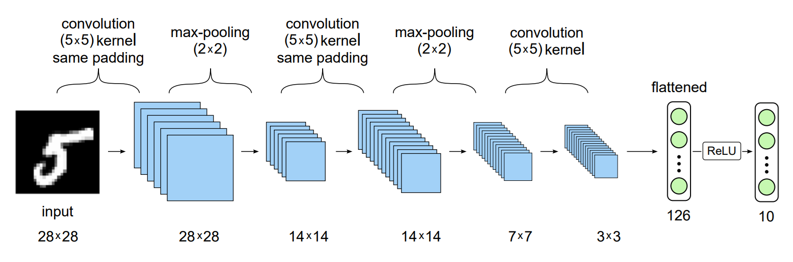
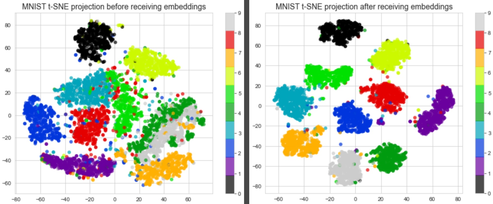
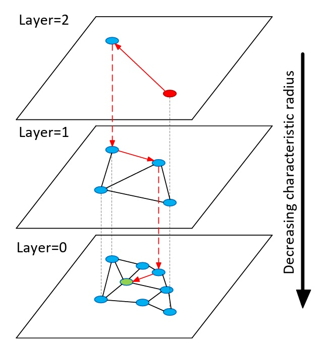
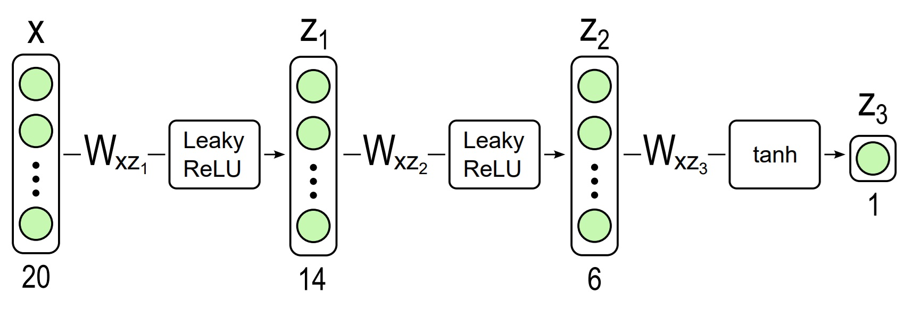

# Мои учебные проекты по машинному обучению

## Список проектов
- [Naive Bayes](#title1)
- [Hierarchical Navigable Small World](#title2)
- [LambdaRank](#title3)

## <a id="title1">Naive Bayes</a>
В данном проекте реализован наивный байесовский классификатор для категоризации спама. Вначале для текстов были составлены их признаковые описания, не учитывающие порядок слов: "bag of words". Для этого тексты были токенизированы, очищены от стоп-слов и нормализованы с помощью лемматизации. Далее тексты были отфильтрованы от слишком редких и частых слов. Затем был составлен словарь и подсчитано количество вхождений слов из словаря для каждого текста. В рамках наивного байеса мы предполагаем, что разные слова в тексте на одну и ту же тему появляются независимо друг от друга. Наивный байес выбирает категорию как:

$$ c(d) = \arg\max_{c \in C}p(x=c) p(d | x=c)$$

Реализованы два типа наивного байеса: мультиномиальный и многомерный. В мультиномиальной модели документ – это последовательность событий, каждое из которых - это случайный выбор одного слова из «bag of words». Такая модель учитывает количество повторений каждого слова, но не учитывает, каких слов нет в документе. При этом правдоподобие принадлежности сообщения $d$ классу c будет равно:

$$ p(d | x=c) = \prod_{i=1}^{|d|} p(w_i | x=c)$$

 В многомерной модели документ – это вектор бинарных атрибутов, показывающих, встретилось ли в документе то или иное слово из словаря. Когда мы подсчитываем правдоподобие документа, мы перемножаем вероятности того, что встретилось каждое слово из документа и вероятности того, что не встретилось каждое словарное слово, которое не встретилось:

 $$ p(d | x=c) = \prod_{i=1}^{|V|} p(w_i | x=c)^{[w_i \in d]} (1 - p(w_i | x=c))^{[w_i \notin d]}$$

Датасет:

В данном проекте используется датасет под названием ["SMS Spam Collection Dataset"](https://archive.ics.uci.edu/dataset/228/sms+spam+collection). Датасет представляет собой 5574 SMS-сообщении которые классифицированы как ham и spam.

References:

 - [Наивный байесовский классификатор (лекция Сергея Николенко)](https://youtu.be/IaxVMeGCK4c?list=PLwdBkWbW0oHHENVCYw_XDAKyeO7MlD80C&t=2085) [(pdf)](https://logic.pdmi.ras.ru/~sergey/teaching/mlspsu22/24-topic.pdf)

 ## <a id="title2">Hierarchical Navigable Small World</a>
В данном проекте реализован алгоритм быстрого поиска ближайших соседей HNSW. В качестве датасеты использовался MNIST. В этом датасете цифры из разных классов плохо разделимы с точки зрения евклидовой метрики, поэтому предварительно были получены эмбеддинги с помощью сверточной нейронной сети, реализованной с помощью PyTorch. Архитектура нейронной сети приведена на картинке ниже.

 Объекты с признаковым описанием полученными таким способом уже хорошо разделимы, что можно увидеть с помощью визуализации TSNE.

HNSW представляет собой слоистую структуру графов. Каждая вершина в графе соответствует одному из векторов запросов. На нулевом слое представлены все вершины из исходной выборки. Вершина, присутствующая на уровне $L$ так же присутствует на уровне выше $L+1$ с вероятностью, которая определяется экспоненциальным распределением. Количество соседей каждой вершины ограниченно константой $M_{max}$. 

Предположим, что структура уже построена, тогда поиск ближайших соседей будет определяться алгоритмом:

- Выбираем вершину (entry point) с которой будет начинаться поиск ближайших соседей к запросу (query).
- Спускаемся с верхнего уровня до нижнего:
    1. Жадно ищем ближайшую к query вершину на текущем уровне.
    2. Спускаемся на уровень ниже в вершину, соответствующую найденной.
- На нулевом уровне жадно ищем $k$ ближайших соседей.

Схематическая реализация поиска представлена на картинке ниже:

Построение структуры определяется следующим алгоритмом:
- Случайным образом выбираем максимальный слой, на котором будет представлен query.
- Выбираем вершину (entry point) с которой будет начинаться поиск ближайших соседей к новой вершине (query).
- На каждом уровне, где будет представлен query:
    1. Жадно ищем $M$ ближайших к query вершин.
    2. Добавляем связи (ребра) query с найденными соседями.
    3. Если число ребер у найденных соседей превысило число $M_{max}$, то удаляем лишние.
    4. Выбираем entry point для нижнего слоя как efConstruction ближайших к query вершин на текущем слое.

 Датасет:
 
В данном проекте использовался набор данных MNIST, состоящий из 70 000 изображений. Каждое изображение — это оцифрованная картинка одной цифры, написанной от руки. Каждое изображение имеет размер 28 × 28 пикселей. Каждое значение пикселя лежит в диапазоне от 0 (представляет белый цвет) до 255 (представляет черный цвет).

 References:

[Efficient and robust approximate nearest neighbor search using Hierarchical Navigable Small World graphs](http://arxiv.org/pdf/1603.09320)

 ## <a id="title3">LambdaRank</a>
В данном проекте вначале из 136 признаков пар query-url были выбраны 20 наиболее значимых с помощью Random Forest Regressor. При этом Random Forest Regressor обучался так, чтобы максимизировать Normalized Discounted Commulative Gain (NDCG) на валидационной выборке.

$$NDCG_K = \frac{DCG_K}{IDCG_K},$$

$$DCG_K = \sum_{n=1}^{K} \frac{2^{r_i}-1}{log_2(1+i)}, $$

где $r_i$ - оценка рейтинга пары query-url на позиции $i$. Далее реализован алгоритм ранжирования - LamdaRank, который основан на идее RankNet. RankNet представляет собой попарный подход к задаче ранжирования, при котором во время обучения используются тройки ($q$, $d_i$, $d_j$), где $d_i$, $d_j$ - документы, полученные по запросу $q$, причем $d_i$ релевантнее $d_j$. Мы будем обучать модель, которая по данному вектору признаков $x$ будет выдавать $f(x)$ и ранжировать документы по полученным результатам. В качестве модели в проекте используется нейронная сеть с архитектурой, представленной на картинке ниже:

Для тестовых данных модель считает $s_i = f(x_i)$ и $s_j = f(x_j)$ и оценивает вероятности того, что $x_i$ будет стоять в выдаче выше, чем  $x_j$:

$$p_{ij} = \frac{1}{1 + e^{-\alpha(s_i - s_j)}}$$

И имея на руках оценки асессоров $q_{ij}$, в нашем датасете это $0$, $1$ или $0.5$ можно определить функцию ошибки как кросс-энтропию:

$$C = -q_{ij}\log(p_{ij}) - (1-q_{ij})\log(1-p_{ij})$$

Дифференцируя эту функцию потерь по весам модели можно получить итоговое правило обновления весов при градиентном спуске:

$$w_k^{t+1} = w_k^t - \eta \sum_{i=1}^{n} \lambda_i \frac{\partial s_i}{\partial w_k}, где$$

$$\lambda_i  =  \sum_{j:(i,j) \in I} \lambda_{ij} - \sum_{j:(j,i) \in I} \lambda_{ij}$$ 

$I$ - множество пар, для которых $x_i$ имееет большую релевантность, чем $x_j$

$$\lambda_{ij} = -\alpha \frac{1}{1 + e^{\alpha(s_i - s_j)}}$$

Таким образом, мы можем делать градиентный спуск не по парам документов, а по отдельным документам, что увеличивает скорость сходимости. $\frac{\partial s_i}{\partial w_k}$ считается с помощью библиотеки автоматического дифференцирования [Autograd](https://github.com/HIPS/autograd). 

Проблема с RankNet в том, что c его помощью оптимизируется число попарных ошибок, а не NDCG. NDCG является кусочно-постоянной функцией, поэтому напрямую оптимизировать ее не удается. Идея LamdaRank заключается в том, чтобы придумать градиенты, которые помогли бы оптимизировать сглаженную версию NDCG. При этом саму функцию потерь нам знать не нужно. Это удается сделать определив $\lambda_{ij}$ как:

$$\lambda_{ij} = -\alpha \frac{1}{1 + e^{\alpha(s_i - s_j)}} |\Delta_{NDCG}|, где$$

$|\Delta_{NDCG}|$ - это то, на сколько изменится NDCG, если поменять $i$ и $j$ местами.

Датасет:

Датасет [Microsoft Learning to Rank Datasets](https://www.microsoft.com/en-us/research/project/mslr/) состоит из векторов признаков, извлеченных из пар query-url вместе с метками оценки релевантности и query id. Оценки релевантности получены принимают 5 значений от 0 (нерелевантно) до 4 (совершенно релевантно). В файлах данных каждая строка соответствует паре query-url. Первый столбец — метка релевантности пары, второй столбец — идентификатор запроса, а следующие 136 столбцов — признаки.

References:

 - [Обучение ранжированию: метрики, RankNet, LambdaRank, MART, LambdaMART (лекция Сергея Николенко)](https://youtu.be/9tNZTPPxKl8) [(pdf)](https://logic.pdmi.ras.ru/~sergey/teaching/mlspsu22/17-ranking.pdf)
 - [From RankNet to LambdaRank to LambdaMART:AnOverview](https://www.microsoft.com/en-us/research/wp-content/uploads/2016/02/MSR-TR-2010-82.pdf)
 - [Learning to Rank with Nonsmooth Cost Functions](https://www.microsoft.com/en-us/research/wp-content/uploads/2016/02/lambdarank.pdf)